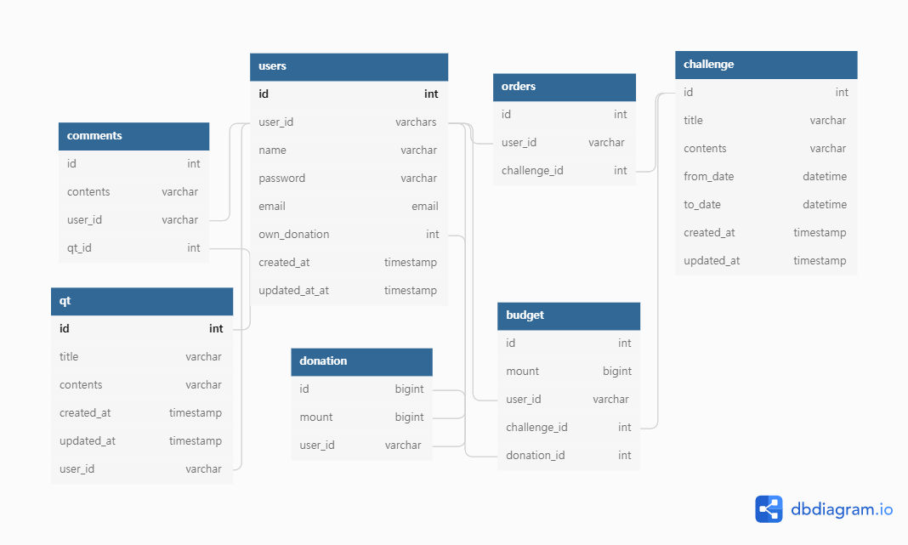
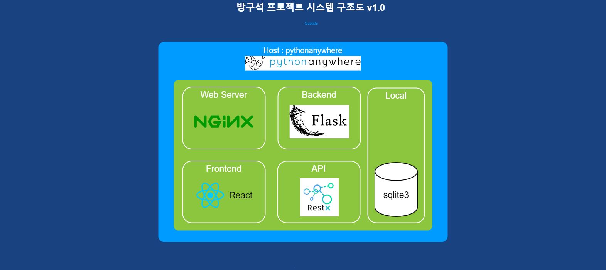

# 방구석 큐티 프로젝트

# Projects : 방구석 큐티

## **목적**

1. 오벤져스 큐티를 위한 챌린지 서비스
2. 큐티 관리 자동화
3. 금전 관리 자동화

## **기능**

1. 멤버
   - 멤버 별 큐티 진행 상황 확인
   - 큐티 히스토리
   - 상대방 큐티 알림
   - 큐티 챌린지 알림
   - 보유 후원금
2. 후원 기금 관리
   - 챌린지 비용 입금 및 출금 관리
   - 챌린지 별 후원 투자
   - 개발자에게 커피 한잔 사주기 (5,000원)
3. 시상식 및 후원금
   - 시상 자동 입금
     - 규칙
   - 챌린지 결과 자동 관리
   - 관리자에게 입금예정 금액 알림

## **대상**

1. 단기
   - 오벤져스 멤버
2. 장기
   - 큐티를 하는 기독교인

## **DB**

- Tools : [DBdiagram.io](http://DBdiagram.io) 사이트
- Table
  - users
  - qt
  - comments
  - donation
  - budget
  - challenge
  - orders



## **시스템 구조도**



## **서비스 구조도**

## 환경

- flask web framework
- react
- dns

## 환경 설정

- python venv

```jsx
python -m venv venv
```

- venv python 가상환경 실행

  ```jsx
  source venv/Scripts/activate
  ```

- requirements.txt

  - 생성명령어

  ```jsx
  pip freeze > requirements.txt
  ```

  - 필요항목 인스톨

  ```jsx
  pip install -r requirements.txt
  ```


- 설치 패키지 목록

  ```jsx
  pip install Flask
  ```

- mariadb

  ```jsx
  pip install mariadb SQLAlchemy
  ```

- dbms

  ```jsx
  pip install mysql-connector-python
  ```

- flask-marshmallow


- flask-restx